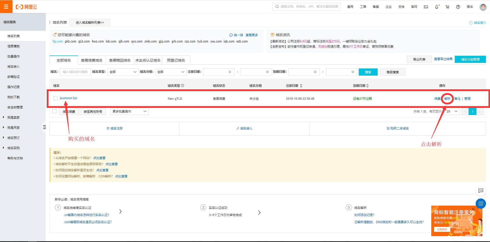
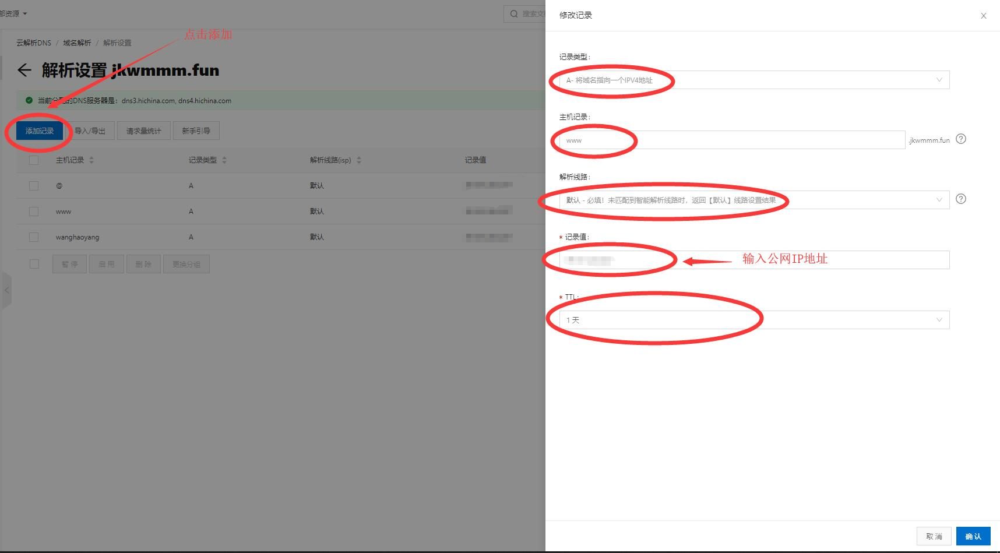

# ---------------服务器域名解析---------------


#### 公网IP可以直接在浏览器访问，但我们更常用的是以 www.***.com 格式访问，而非打一串复杂难记的数字； </br>
#### www.***.com 是一个类似指针的东西（叫做域名），它指向的地址就是公网IP，这个指针需要自己申请或购买。</br>


## 一、购买完毕后，进入控制台，找到已购买的域名，点击解析；</br>

## 二、进入云解析DNS界面，添加解析设置记录，其中记录值为公网IP地址。 </br>


<table>
    <tr>
        <td ><center></center></td>
        <td ><center></center></td>
    </tr>
</table>

</br></br></br></br>

## 三、此时即可以通过 http://**:18080/ 方式访问网站。 </br>

```
浏览器键入：
//www.域名.com:8800
http://jkwmmm.fun:18080/
```

## 四、但是！好像还是不对，别人的网站不要带端口号？ </br>

需要备案！</br>
找到服务器的客服，需要购买3个月后的服务器才具备备案资格，备案审核成功后我们才能通过 www.域名.com 访问网站。</br>
