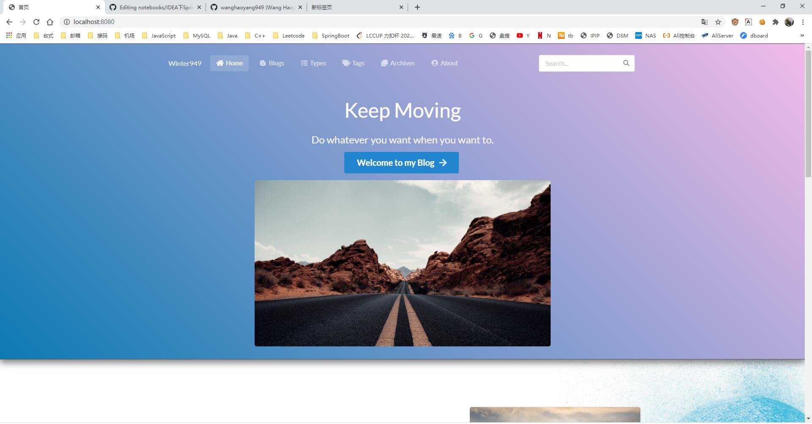
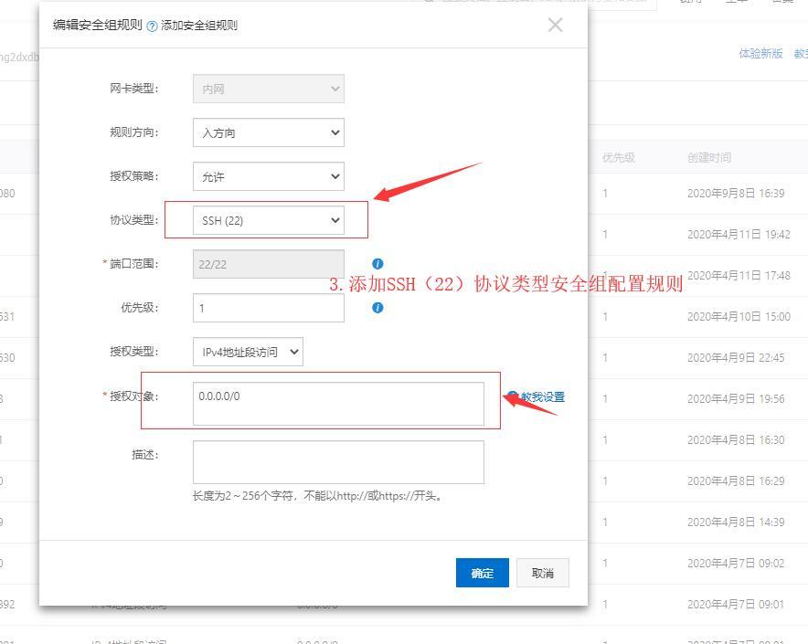
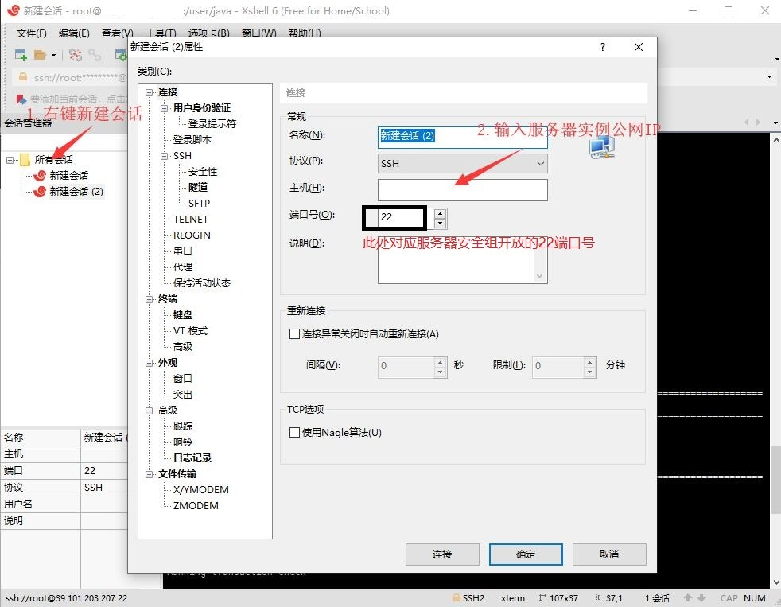
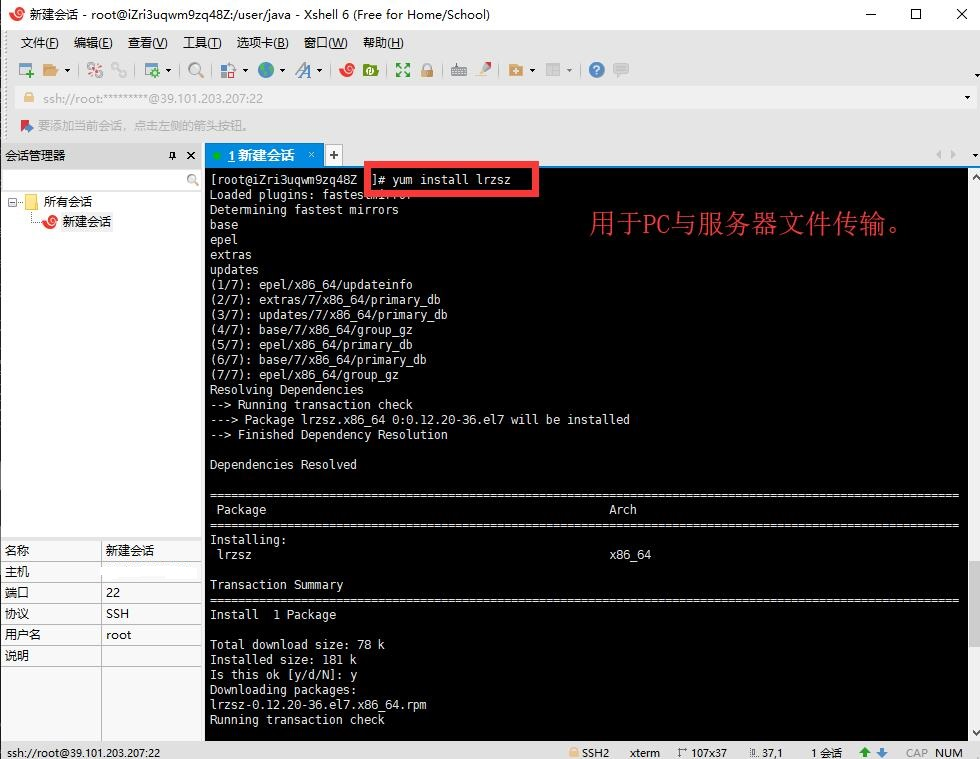
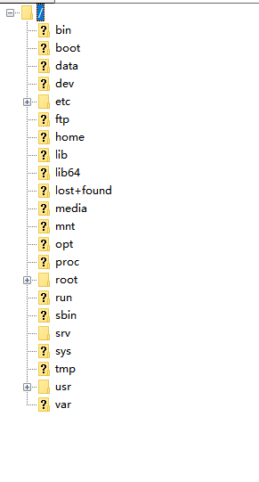
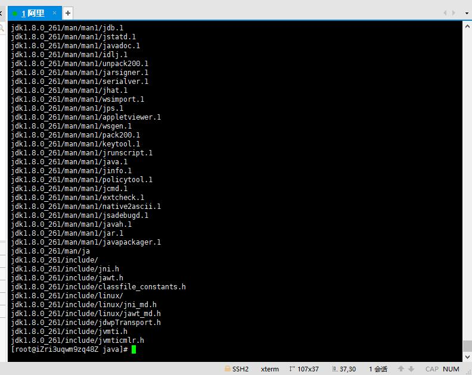
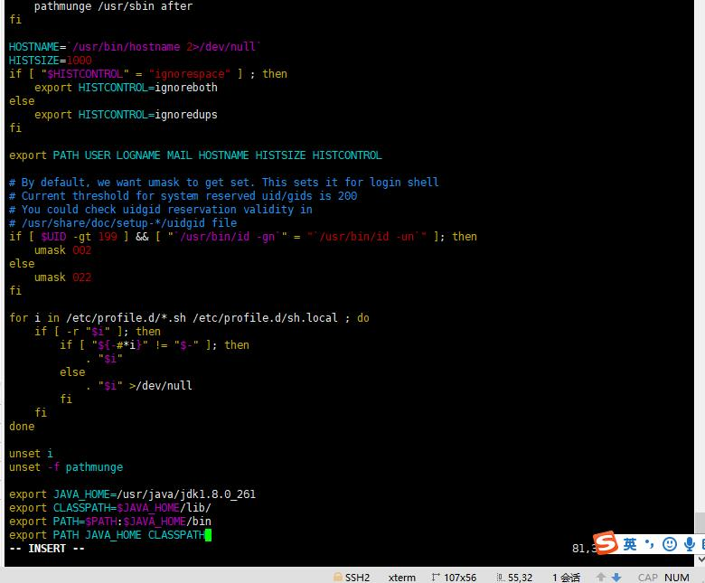
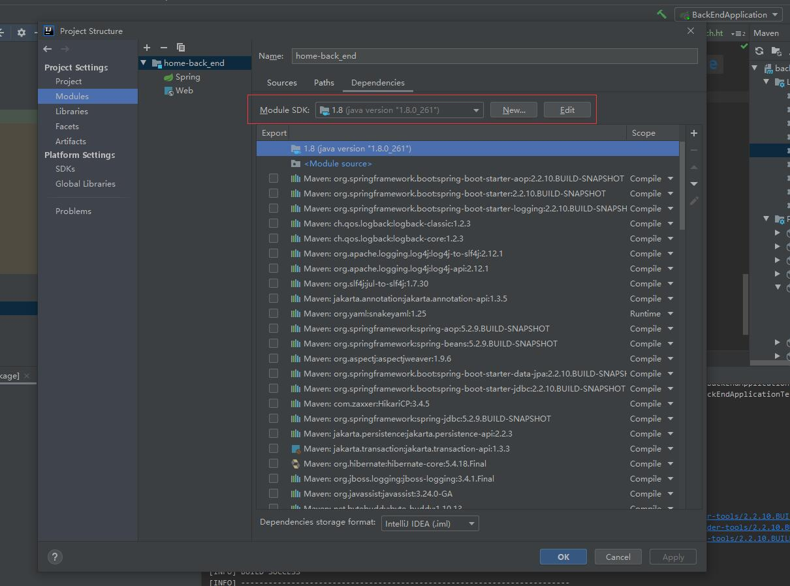
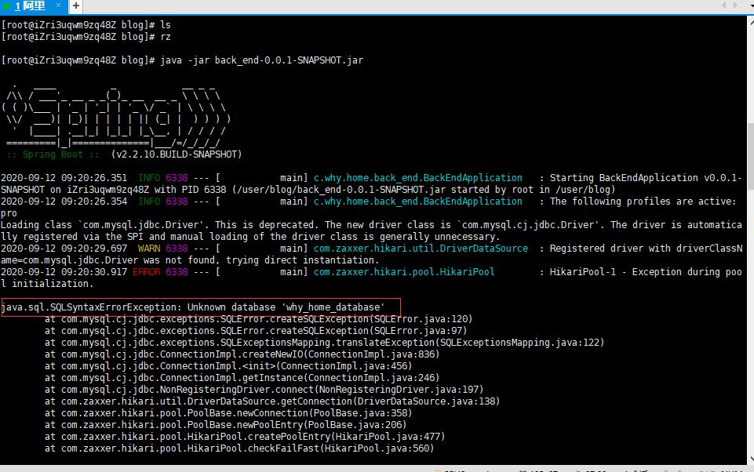

# ---------------IDEA下SpringBoot项目以Jar方式部署---------------

## 一、IDEA下打包SpringBoot项目到JAR文件并测试：


#### 1. 在pom.xml下添加packaging配置和spring-boot-maven-plugin插件: </br>

<table>
    <tr>
        <td ><center></center></td>
        <td ><center></center></td>
    </tr>
</table>

这个插件可以在项目打包成jar包后，通过java -jar运行，如果你的pom.xml文件里面有这句话就不用添加了。
```
<!-- 打包成jar包 -->
<packaging>jar</packaging>
```
```
  <build>
        <plugins>
            <plugin>
                <groupId>org.springframework.boot</groupId>
                <artifactId>spring-boot-maven-plugin</artifactId>
            </plugin>
        </plugins>
  </build>
```

#### 2. 在application.yml下配置项目开发和运行环境: </br>

<table>
    <tr>
        <td ><center></center></td>
        <td ><center></center></td>
    </tr>
</table>

将application.yml中 profiles-active-更改为pro配置。
将application-pro.yml中sever端口号修改为服务器使用端口号，并在后面服务器安全组配置中开启对应端口，如下所示：
```
spring:
  datasource:
    driver-class-name: com.mysql.cj.jdbc.Driver
    url: jdbc:mysql://localhost:3306/why_home_database?useUnicode=true&characterEncoding=utf-8&serverTimezone=Asia/Shanghai
    username: root
    password: q5967738
  jpa:
    hibernate:
      ddl-auto: update
    show-sql: true

logging:
  level:
    root: warn
    com.why.home: info
  file: log/whyhome-pro.log

server:
  port: 18080
```


#### 3. 在IDEA右侧Maven里面打包: </br>
配置完毕，在IDEA界面右侧 项目名称——>maven——>Lifecycle——>右键package——>Run Maven Build，这个菜单就和DataBase在一起，如果看不见就点击IDEA最左下角的方块图标。</br>
点击完后，IDEA下方Run窗口会有一堆信息，里面就包含着jar包的位置，如果信息太多找不到就搜索：Building jar，后面的盘符信息就是jar包的位置了。</br>
例如：Building jar: D:\IdeaProjects\why_home-master\target\back_end-0.0.1-SNAPSHOT.jar 即指明了JAR位置。</br>


#### <Windows下演示>: </br>
在CMD命令窗口里运行jar包：
```
cd D:\IdeaProjects\why_home-master\target\ 
java -jar back_end-0.0.1-SNAPSHOT.jar
```
观察到运行成功后，可以打开浏览器测试，当关闭cmd时，web则无法找到，如下图所示。
<table>
    <tr>
        <td ><center></center></td>
        <td ><center></center></td>
    </tr>
</table>

## 二、云服务器安全组配置： </br>
进入云服务器实例界面，对安全组进行配置，添加SSH(22)协议类型，同时将第一步中涉及到的端口号开启。
<table>
    <tr>
        <td ><center></center></td>
        <td ><center></center></td>
    </tr>
</table>

## 三、安装XShell远程连接云服务器，便于操作： </br>
下载链接：https://www.netsarang.com/zh/xshell/ </br>
安装完毕后，按图示添加服务器配置，输入账号密码登录，连接远程云服务器：
<table>
    <tr>
        <td ><center></center></td>
        <td ><center></center></td>
        <td ><center></center></td>
    </tr>
</table>

## 四、配置Centos，安装rz文件传输工具和JDK：

<table>
    <tr>
        <td ><center></center></td>
        <td ><center></center></td>
    </tr>
</table>

#### 1.安装rz文件传输工具：</br>
连接完成后，首先安装rz文件传输工具，在Xshell中执行以下代码：</br>

```
yum install lrzsz
```

在提示后输入y并回车，安装成功则如左图所示。

#### 2.下载并上传Linux JDK到服务器指定文件夹（最好放在此处方便环境变量配置）：</br>
JDK下载链接：https://www.oracle.com/java/technologies/javase/javase-jdk8-downloads.html 选择类似 jdk-8u261-linux-x64.tar.gz 的版本。 </br>
若需使用甲骨文账号登录下载，账号为谷歌邮箱：wanghaoyang949@gmail.com，密码大写小写数字。 </br>
下载完毕后，首先了解Centos文件夹结构目录，如右图所示。然后建立在Centos中建立文件夹 /user/java ：

```
显示文件夹构成：
dir
新建：
mkdir fileName
删除：
rm -rf fileName
进入java文件夹：
cd /
cd user
cd java
命令行输入指令上传 jdk-8u261-linux-x64.tar.gz 文件：
rz
查看文件夹内所有文件可以用：
ls
```

#### 3.解压缩，配置Linux系统环境变量：</br>
在 jdk-8u261-linux-x64.tar.gz 所在文件夹中输入tar命令用于解压：

```
tar -zxvf jdk-8u261-linux-x64.tar.gz
```

配置系统环境变量，首先打开文件 /etc/profile ：

```
cd /
cd etc
vim profile
开始编辑：
i
粘贴后保存：
ESC->冒号->wq->ENTER
添加完成后使用source依次执行文件所有语句： 
source /etc/profile
```

向profile中添加的代码：

```
export JAVA_HOME=/user/java/jdk1.8.0_261
export CLASSPATH=$JAVA_HOME/lib/
export PATH=$PATH:$JAVA_HOME/bin
export PATH JAVA_HOME CLASSPATH
```

<table>
    <tr>
        <td ><center></center></td>
        <td ><center></center></td>
        <td ><center></center></td>
    </tr>
</table>

#### 4.验证JDK安装是否成功：

```
java -version
```
<table>
    <tr>
        <td ><center></center></td>
    </tr>
</table>


## 五、配置Centos，安装MySQL数据库：

<table>
    <tr>
        <td ><center></center></td>
        <td ><center></center></td>
        <td ><center></center></td>
    </tr>
</table>

#### 1.安装MySQL环境：</br>
JDK配置完毕后，开安装MySQL环境：</br>
wget后面的版本在此网站查看：https://dev.mysql.com/downloads/repo/yum/ （看好要求的Linux版本！）</br>
示例为安装MySQL 8.0 版本：
```
cd到/usr/local/src/
wget http://dev.mysql.com/get/mysql80-community-release-el7-3.noarch.rpm
rpm -ivh mysql80-community-release-el7-3.noarch.rpm

查看安装效果：
yum repolist enabled | grep mysql.*

安装MySQL服务器：
//yum install mysql-community-server
sudo yum --enablerepo=mysql80-community install mysql-community-server
```

#### 重新安装时若报错：
```
Error: Package: mysql-community-server-8.0.21-1.el8.x86_64 (mysql80-community) 
Requires: libstdc++.so.6(CXXABI_1.3.11)(64bit)
```
需要清理缓存！
```
yum clean all
```
</br>

成功。


安装成功后重启mysql服务。

```
systemctl restart mysqld 
```

#### 2.配置MySQL环境：</br>

重启服务后，对MySQL环境进行配置：
<table>
    <tr>
        <td ><center></center></td>
        <td ><center></center></td>
    </tr>
</table>

```
1.查看MySQL临时密码：
grep "A temporary password" /var/log/mysqld.log

2.进入MySQL：
mysql -uroot -p

3.修改密码：
ALTER USER 'root'@'localhost' IDENTIFIED BY 'password';

4.若策略不满足，修改策略后再修改密码：
//validate_password.length 是密码的最小长度，默认是8，我们把它改成6：
set global validate_password.length=6;
//validate_password.policy 验证密码的复杂程度，我们把它改成0：
set global validate_password.policy=0;
//validate_password.check_user_name 用户名检查，用户名和密码不能相同，我们也把它关掉：
set global validate_password.check_user_name=off;

5.编辑my.cnf配置文件：
vim /etc/my.cnf

6.在[mysqld]下添加如下三项：
#跳过登录验证
#设置默认字符集UTF-8
#设置默认字符集UTF-8
# 设置3306端口
# 创建新表时将使用的默认存储引擎
# 默认使用“mysql_native_password”插件认证
skip-grant-tables   
character_set_server=utf8   
init_connect='SET NAMES utf8'  
port=3306
default-storage-engine=INNODB
default_authentication_plugin=mysql_native_password
```
同时可添加：
```
[mysql]
# 设置mysql客户端默认字符集
default-character-set=utf8

[client]
# 设置mysql客户端连接服务端时默认使用的端口
port=3306
default-character-set=utf8
```


#### 3.数据库创建和管理员数据插入：</br>

进入bin运行：
```
mysql -u root -p
```
添加指定数据库：
```
create database why_home_database; 
```
可以先运行一遍使用SpringBoot JPA自动创建表，然后在home_user表存在的基础上插入管理员数据，注意用MD5加密设置密码：
```
use why_home_database;

INSERT INTO home_user (id,avatar, create_time , email, nickname , password, type ,update_time ,username) VALUES (1,' https://images.unsplash.com/photo-1597098495323-fc5d2ac74f75?ixlib=rb-1.2.1&ixid=eyJhcHBfaWQiOjEyMDd9&auto=format&fit=crop&w=800&q=60', '2020-08-22 10:55:55', '363057994@qq.com','winter','password',1, '2020-08-23 20:16:00', 'why');
```


#### <MySQL其他相关配置>:
```
1、设置安全选项
mysql_secure_installation

2、关闭MySQL
systemctl stop mysqld 

3、重启MySQL
systemctl restart mysqld 

4、查看MySQL运行状态
systemctl status mysqld 

5、设置开机启动
systemctl enable mysqld 

6、关闭开机启动
systemctl disable mysqld 

7、配置默认编码为utf8
vi /etc/my.cnf #添加 [mysqld] character_set_server=utf8 init_connect='SET NAMES utf8'
其他默认配置文件路径：
配置文件：/etc/my.cnf 日志文件：/var/log//var/log/mysqld.log 服务启动脚本：/usr/lib/systemd/system/mysqld.service socket文件：/var/run/mysqld/mysqld.pid

8、查看版本
select version();
```

## 六、部署SpringBoot项目：

#### 1.配置Tomcat？</br>
云服务器上的环境配置好像差了一个tomcat？不，因为SpringBoot内置了Tomcat，所以后面我们把它打包成jar包就可以免去Tomcat的配置了（如果是打包成war包，那还是要配置Tomcat的）。</br>

#### 2.上传JAR文件到云服务器：</br>
按照之前新建目录，在服务器下/user/下建立blog目录，cd进blog，rz上传生成的JAR包。


#### 3.检查端口是否被占用：</br>
要想在服务器上运行这个项目，就要保证项目运行所用的端口没有被占用，不然运行就会报错。使用以下指令查看端口使用情况：
```
//netstat -anp | grep <端口号> 端口号为想要检查的端口号
netstat -anp | grep 18080   
```
指令运行后不显示任何东西则没有被占用。</br>
若被占用则会显示一条端口信息，可以使用如下指令查看占用端口的PID：
```
//sudo lsof -i:<端口号>
sudo lsof -i:18080  
```
获取PID号后，可以将其kill掉，留出空位来运行项目：
```
//sudo kill -9 <PID>
sudo kill -9 26191  
```
kill后再次netstat查看端口，可以看到这个端口不再被占用。


#### 4.运行项目！</br>
端口检测完成，开启项目吧！
```
java -jar back_end-0.0.1-SNAPSHOT.jar
```

运行成功：（如报错参考下面解决办法）


#### 5.持久后台运行！</br>

上述启动方式是一次启动，当我们关掉Xshell时，网站又无法访问，需重新打开Xshell，执行 
```
java -jar back_end-0.0.1-SNAPSHOT.jar
```
若要让这个项目在服务器上自动不间断地跑，使用如下指令！
```
nohup java -jar  back_end-0.0.1-SNAPSHOT.jar  & 
```
若要关闭后台运行程序：
```
先查看PID：
ps -aux | grep java

得到：
root      3339  0.1 16.1 3556696 627676 ?      Sl   00:13   1:02 java -jar back_end-0.0.1-SNAPSHOT.jar
root     30471  0.0  0.0 112808   964 pts/0    S+   09:14   0:00 grep --color=auto java

再关闭：
kill -s 9 PID号(3339)
```
同时可使用指令查看日志：
```
tail -f nohup.out
```
把Xshell关掉，在浏览器上输入http://公网IP:8800 发现项目还是可以进入，设置成功！至此SpringBoot项目部署完结。</br>

</br></br></br></br></br></br></br></br></br></br></br></br></br></br>


## <遇到问题>：

#### 1.运行JAR项目时 Exception in thread "main" java.lang.UnsupportedClassVersionError：</br>


解决：</br>
将maven项目所要求的java版本改成1.8，即POM文件添加如下配置：
```
<properties>
        <java.version>1.8</java.version>
</properties>
```

同时在开发环境安装与服务器相同版本的JDK，链接为：https://www.oracle.com/java/technologies/javase/javase-jdk8-downloads.html  </br>


完毕配置系统变量环境，然后在IDEA项目中按照如下方式配置：</br>
1.Project Struture中添加1.8版本JDK和SDK，且将Project language level换为8；</br>
2.Java Compiler中Project Bytecode Version改为8。</br>
详细配置如下图所示：</br>

<table>
    <tr>
        <td ><center></center></td>
        <td ><center></center></td>
        <td ><center></center></td>
        <td ><center></center></td>
        <td ><center></center></td>
        <td ><center></center></td>
        <td ><center></center></td>
    </tr>
</table>


#### 2.运行JAR项目时 java.sql.SQLSyntaxErrorException: Unknown database 'why_home_database'：</br>



原因：数据库表未创建。</br>
进入bin运行：
```
mysql -u root -p
```
添加指定数据库：
```
create database why_home_database; 
```
操作如图所示： </br>


#### 3.公网IP访问网页时 org.springframework.dao.InvalidDataAccessResourceUsageException: could not extract ResultSet; SQL [n/a]; nested exception is org.hibernate.exception.SQLGrammarException: could not extract ResultSet：</br>


原因：在pro-yml->jpa->hibernata->ddl-auto设置问题。</br>
解决：更改为update：
```
  jpa:
    hibernate:
      ddl-auto: update
    show-sql: true
```
说明：
```
spring.jpa.hibernate.ddl-auto=create-drop

可选参数:
create 启动时删数据库中的表，然后创建，退出时不删除数据表
create-drop 启动时删数据库中的表，然后创建，退出时删除数据表 如果表不存在报错
update 如果启动时表格式不一致则更新表，原有数据保留
validate 项目启动表结构进行校验 如果不一致则报错
```


#### 4.公网IP访问网页时 java.lang.IndexOutOfBoundsException: Index: 0, Size: 0：</br>

<table>
    <tr>
        <td ><center></center></td>
        <td ><center></center></td>
    </tr>
</table>

问题：web层HomepageController逻辑错误。</br>
解决：</br>
HomepageController修改，加if判断：
```
    /*通过Get请求路径 返回首页*/
    @GetMapping("/")
    public String homepage(Model model) {
        /* Model存储查询后的分页信息 从而输出给前端页面 进行数据渲染 */
        /* blogService.listBlog(pageable,blog)返回类似JSON的信息 */
        List<Blog> blogs=blogService.listBlogTop(3);
        if(blogs.size() == 3){
            model.addAttribute("blog_1",blogs.get(0));
            model.addAttribute("blog_2",blogs.get(1));
            model.addAttribute("blog_3",blogs.get(2));
        }
        return "home";
    }
```
home.html修改，加 th:if：
```
<div>
        <div class="ui vertical stripe segment" th:if="${blog_1 != null}">
        <div class="ui vertical stripe quote segment">
        <div class="ui vertical stripe segment" th:if="${blog_2 != null && blog_3 != null}">
</div>
```

同理关于TagClientController和TypeClientController的IndexOutOfBoundsException也做类似修改！
```
        List<Tag> tags=tagService.listTagTop(100);
        /* 判断id为-1 则访问以第一个标签为主题访问标签页 */
        if(tags.size()>0 && id == -1){
            id = tags.get(0).getId();
        }
```

<table>
    <tr>
        <td ><center></center></td>
        <td ><center></center></td>
    </tr>
</table>

#### 5.新增分类时 java.sql.SQLException: Illegal mix of collations (latin1_swedish_ci,IMPLICIT) and (utf8mb4_general_ci,COERCIBLE) for operation ‘=’：</br>

<table>
    <tr>
        <td ><center></center></td>
    </tr>
</table>

问题：数据表的编码信息有误，需更改为utf-8。</br>
通用解决：</br>
1、修改表的编码
```
//ALTER TABLE 表名 CONVERT TO CHARACTER SET utf8mb4 COLLATE utf8mb4_bin;
ALTER TABLE why_home_database CONVERT TO CHARACTER SET utf8mb4 COLLATE utf8mb4_bin;
```
2、查看表的编码信息
```
show variables like 'character_set_%';
# 正常情况
character_set_client utf8
character_set_connection utf8
character_set_database utf8
character_set_filesystem binary
character_set_results utf8
character_set_server utf8
character_set_system utf8
# 如果不相同则使用如下命令修改
set character_set_client = 'utf8'
set character_set_connection = 'utf8'
set character_set_database = 'utf8'
set character_set_results = 'utf8'
set character_set_server = 'utf8'
```
3、查看collation排序规则
```
show variables like 'collation_%';
# 正常情况
collation_connection utf8_general_ci
collation_database utf8_general_ci
collation_server utf8_general_ci
# 如果修改则使用如下命令
set collation_database='utf8_general_ci';
SET collation_connection = 'utf8_general_ci'; 
SET collation_server = 'utf8_general_ci'; 
或
SET collation_database = 'latin1_swedish_ci'; 
SET collation_connection = 'latin1_swedish_ci'; 
SET collation_server = 'latin1_swedish_ci';
```
进行修改后可以正常向数据库插入数据。</br>
针对我的问题解决：

<table>
    <tr>
        <td ><center></center></td>
        <td ><center></center></td>
    </tr>
</table>

```
修改表编码：
//ALTER TABLE 表名 CONVERT TO CHARACTER SET utf8mb4 COLLATE utf8mb4_bin;
ALTER TABLE hibernate_sequence CONVERT TO CHARACTER SET utf8mb4 COLLATE utf8mb4_bin;
ALTER TABLE home_blog CONVERT TO CHARACTER SET utf8mb4 COLLATE utf8mb4_bin;
ALTER TABLE home_blog_tags CONVERT TO CHARACTER SET utf8mb4 COLLATE utf8mb4_bin;
ALTER TABLE home_comment CONVERT TO CHARACTER SET utf8mb4 COLLATE utf8mb4_bin;
ALTER TABLE home_tag CONVERT TO CHARACTER SET utf8mb4 COLLATE utf8mb4_bin;
ALTER TABLE home_type CONVERT TO CHARACTER SET utf8mb4 COLLATE utf8mb4_bin;
ALTER TABLE home_user CONVERT TO CHARACTER SET utf8mb4 COLLATE utf8mb4_bin;
设置表编码：
set character_set_database = 'utf8'
set character_set_server = 'utf8'
```
成功：
<table>
    <tr>
        <td ><center></center></td>
    </tr>
</table>
