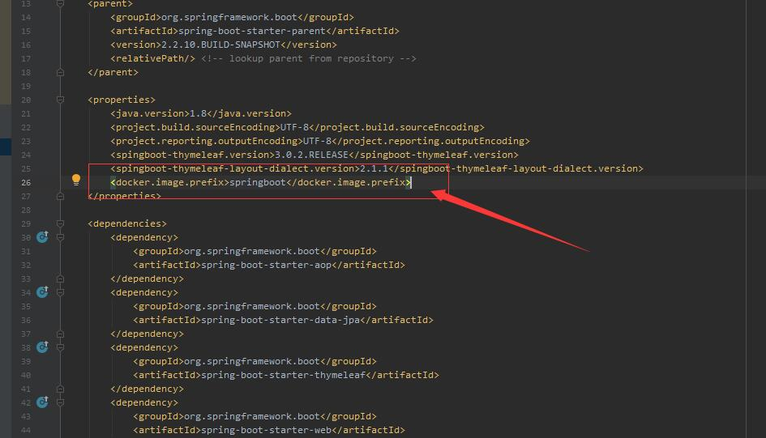
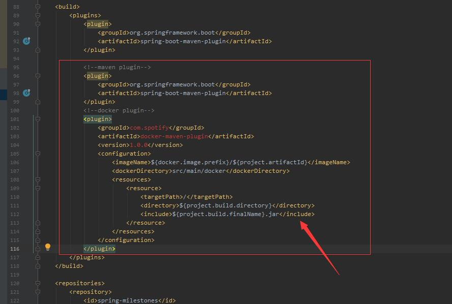
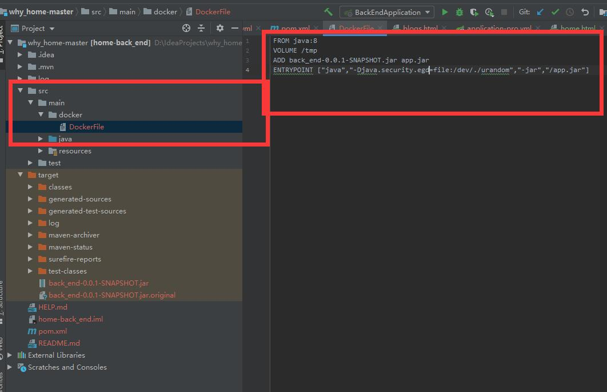

# ---------------Docker部署SpringBoot项目---------------

## 一、Centos服务器环境搭建： </br>


#### 1. 检查系统内核版本: </br>
Docker运行在CentOS 7上，要求操作系统为64位，内核版本为3.10及以上。确认本机已经安装了满足要求的Linux内核，使用命令uname -r来检查内核版本信息。
```
[root@localhost ~]# uname -r
3.10.0-957.el7.x86_64
```

#### 2. 在CentOS中安装Docker: </br>
Docker运行在CentOS 7上，要求操作系统为64位，内核版本为3.10及以上。确认本机已经安装了满足要求的Linux内核，使用命令uname -r来检查内核版本信息。
```
1.使用一下命令安装Docker：
yum install -y docker
“-y”表示不询问，使用默认配置进行安装
2.同时使用阿里云镜像安装也可：
curl -fsSL https://get.docker.com | bash -s docker --mirror Aliyun
```

输入指令docker version，若安装成功可以看到：
```
[root@iZri3uqwm9zq48Z docker_test]# docker version
Client: Docker Engine - Community
 Version:           19.03.12
 API version:       1.40
 Go version:        go1.13.10
 Git commit:        48a66213fe
 Built:             Mon Jun 22 15:46:54 2020
 OS/Arch:           linux/amd64
 Experimental:      false
Cannot connect to the Docker daemon at unix:///var/run/docker.sock. Is the docker daemon running?
```

#### 3. 启动Docker服务，并设置为开机自启动: </br>

```
systemctl start docker.service
systemctl enable docker.service
```

输入指令docker version，若运行成功可以看到：
```
[root@iZri3uqwm9zq48Z docker_test]# docker version
Client: Docker Engine - Community
 Version:           19.03.12
 API version:       1.40
 Go version:        go1.13.10
 Git commit:        48a66213fe
 Built:             Mon Jun 22 15:46:54 2020
 OS/Arch:           linux/amd64
 Experimental:      false

Server: Docker Engine - Community
 Engine:
  Version:          19.03.12
  API version:      1.40 (minimum version 1.12)
  Go version:       go1.13.10
  Git commit:       48a66213fe
  Built:            Mon Jun 22 15:45:28 2020
  OS/Arch:          linux/amd64
  Experimental:     false
 containerd:
  Version:          1.2.13
  GitCommit:        7ad184331fa3e55e52b890ea95e65ba581ae3429
 runc:
  Version:          1.0.0-rc10
  GitCommit:        dc9208a3303feef5b3839f4323d9beb36df0a9dd
 docker-init:
  Version:          0.18.0
  GitCommit:        fec3683
```


## 二、SpringBoot项目pom.xml依赖添加： </br>

#### 1. properties 依赖添加: </br>
在properties中添加docker.image.prefix镜像前缀名springboot。

```
<properties>
        <docker.image.prefix>springboot</docker.image.prefix>
</properties>
```

#### 2. build-plugins 配置docker插件 : </br>
在build中添加docker插件。

```
<build>
     <plugins>
          <!--docker plugin-->
            <plugin>
                <groupId>com.spotify</groupId>
                <artifactId>docker-maven-plugin</artifactId>
                <version>1.0.0</version>
                <configuration>
                    <imageName>${docker.image.prefix}/${project.artifactId}</imageName>
                    <dockerDirectory>src/main/docker</dockerDirectory>
                    <resources>
                        <resource>
                            <targetPath>/</targetPath>
                            <directory>${project.build.directory}</directory>
                            <include>${project.build.finalName}.jar</include>
                        </resource>
                    </resources>
                </configuration>
            </plugin>
     </plugins>
</build>
```

#### 3. 在SpringBoot项目/src/main/docker目录下新建Dockerfile文件 : </br>

Dockerfile文件内容如下：

```
FROM java:8 
VOLUME /tmp 
ADD back_end-0.0.1-SNAPSHOT.jar app.jar
ENTRYPOINT ["java","-Djava.security.egd=file:/dev/./urandom","-jar","/app.jar"]
```

说明：</br>
java:8 代表使用的jdk版本；</br>
VOLUME 指定了临时文件目录为 /tmp；</br>
复制项目 back_end-0.0.1-SNAPSHOT.jar 文件并重命名为 "app.jar" 添加到容器中；</br>
ENTRYPOINT 执行项目 app.jar。为了缩短 Tomcat 启动时间，添加一个系统属性指向 “/dev/urandom” 作为 Entropy Source。</br>

<table>
    <tr>
        <td ><center></center></td>
        <td ><center></center></td>
        <td ><center></center></td>
    </tr>
</table>


## 三、Centos服务器上部署docker项目： </br>

#### 1. 在centos上创建文件夹 ~/user/docker_test ，上传jar包和Dockerfile文件到docker文件夹: </br>
在properties中添加docker.image.prefix镜像前缀名springboot。

```
mkdir /user/docker_test
rz
```

<table>
    <tr>
        <td ><center></center></td>
    </tr>
</table>

#### 2. 在docker文件夹下构建项目的镜像: </br>
构建镜像：

```
docker build -t docker .
```

说明：</br>
执行docker build命令，docker就会根据Dockerfile里你定义好的命令进行构建新的镜像。</br>
-t代表要构建的镜像的tag，</br>
.代表当前目录，也就是Dockerfile所在的目录。</br>
</br>
查看镜像：

```
docker images
```
</br>
创建并运行容器：

```
docker run -d -p 18080:18080 docker
```
说明：</br>
-d：后台运行。</br>
-p 18080:18080：表示将本地主机的18080端口被映射到容器的18080端口。</br>
-t springboot/springboot-docker：表示告诉docker要运行哪个镜像。 </br>
--name：给容器命名。</br>

查看刚刚启动的容器：

```
docker ps
```

查看指定容器的日志：
```
docker logs 
```
