# ---------------IDEA下SpringBoot项目以Jar方式部署---------------

## 一、IDEA下打包SpringBoot项目到JAR文件并测试：

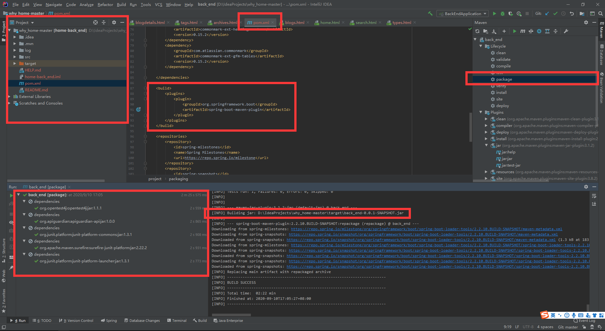

#### 1. 在pom.xml下添加如下插件: </br>
这个插件可以在项目打包成jar包后，通过java -jar运行。如果你的pom.xml文件里面有这句话就不用添加了。
```
  <build>
        <plugins>
            <plugin>
                <groupId>org.springframework.boot</groupId>
                <artifactId>spring-boot-maven-plugin</artifactId>
            </plugin>
        </plugins>
  </build>
```
#### 2. 在IDEA右侧Maven里面打包: </br>
在IDEA界面右侧 项目名称——>maven——>Lifecycle——>右键package——>Run Maven Build，这个菜单就和DataBase在一起，如果看不见就点击IDEA最左下角的方块图标。</br>
点击完后，IDEA下方Run窗口会有一堆信息，里面就包含着jar包的位置，如果信息太多找不到就搜索：Building jar，后面的盘符信息就是jar包的位置了。</br>
例如：Building jar: D:\IdeaProjects\why_home-master\target\back_end-0.0.1-SNAPSHOT.jar 即指明了JAR位置。</br>


#### <Windows下演示>: </br>
在CMD命令窗口里运行jar包：
```
cd D:\IdeaProjects\why_home-master\target\ 
java -jar back_end-0.0.1-SNAPSHOT.jar
```
观察到运行成功后，可以打开浏览器测试，当关闭cmd时，web则无法找到，如下图所示。
<table>
    <tr>
        <td ><center>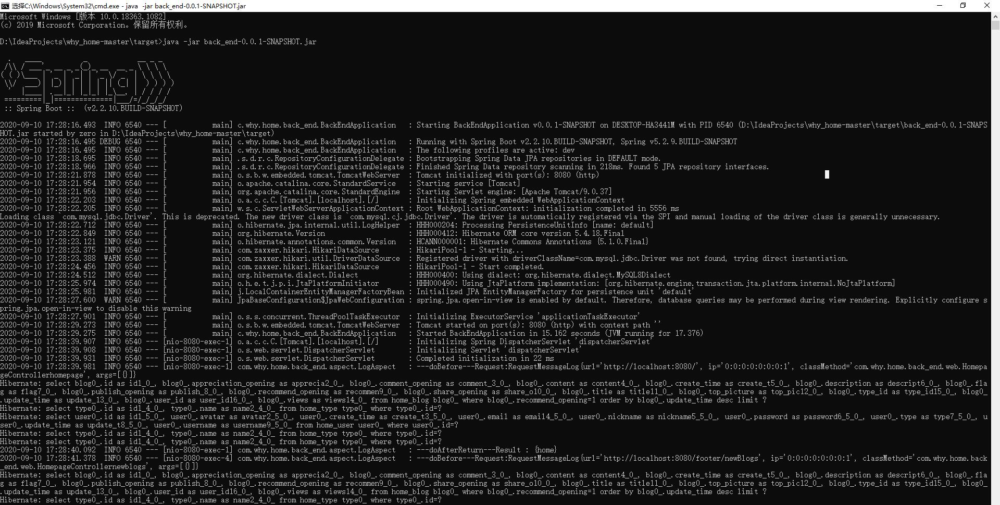</center></td>
        <td ><center>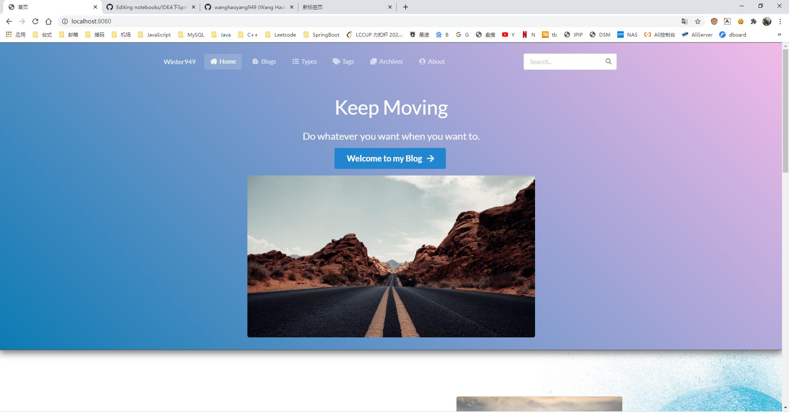</center></td>
    </tr>
</table>

## 二、云服务器安全组配置： </br>
进入云服务器实例界面，对安全组进行配置，添加SSH(22)协议类型。
<table>
    <tr>
        <td ><center>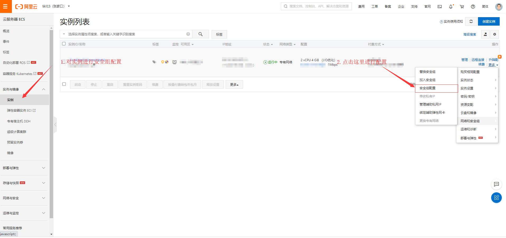</center></td>
        <td ><center>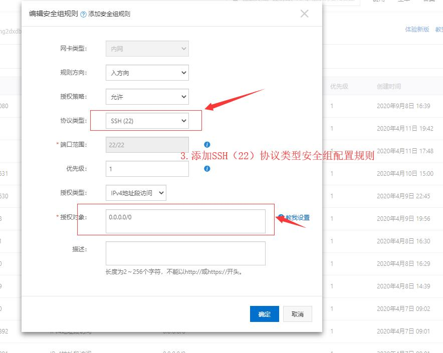</center></td>
    </tr>
</table>

## 三、安装XShell远程连接云服务器，便于操作： </br>
下载链接：https://www.netsarang.com/zh/xshell/ </br>
安装完毕后，按图示添加服务器配置，输入账号密码登录，连接远程云服务器：
<table>
    <tr>
        <td ><center>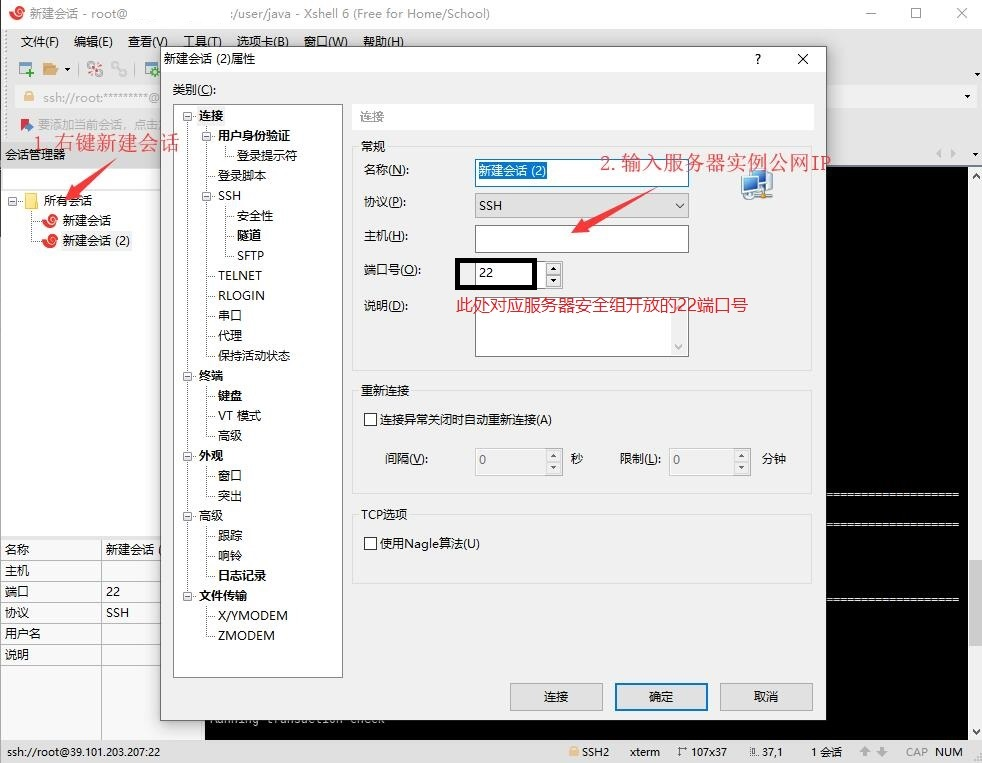</center></td>
        <td ><center>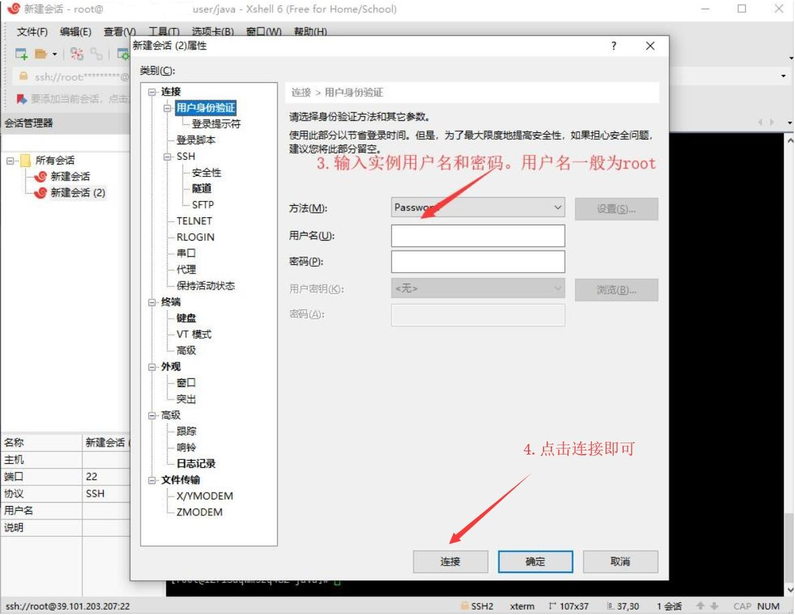</center></td>
        <td ><center>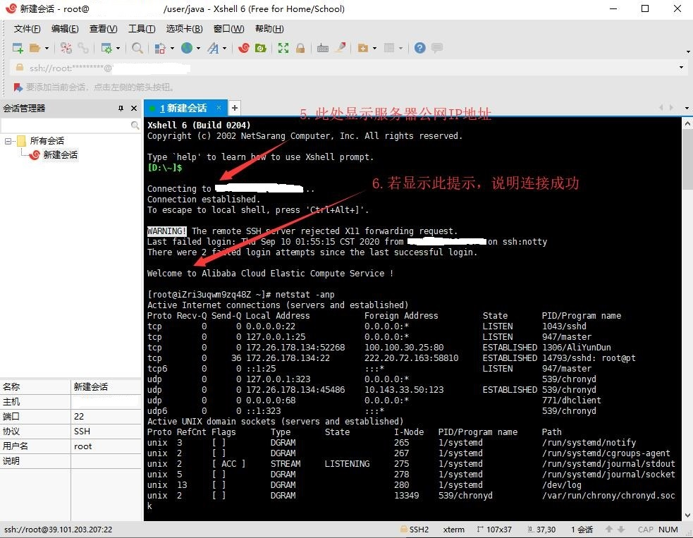</center></td>
    </tr>
</table>

## 四、配置Centos，安装rz文件传输工具和JDK：
<table>
    <tr>
        <td ><center>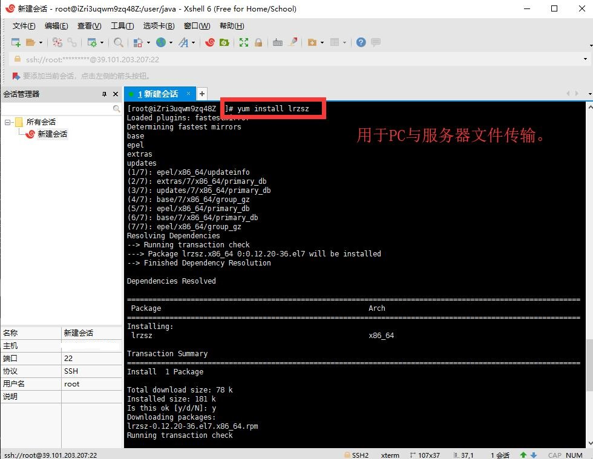</center></td>
        <td ><center>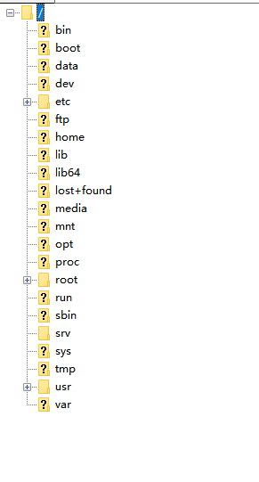</center></td>
    </tr>
</table>

#### 1.安装rz文件传输工具：</br>
连接完成后，首先安装rz文件传输工具，在Xshell中执行以下代码：</br>

```
yum install lrzsz
```

在提示后输入y并回车，安装成功则如左图所示。

#### 2.下载并上传Linux JDK到服务器指定文件夹（最好放在此处方便环境变量配置）：</br>
JDK下载链接：https://www.oracle.com/java/technologies/javase/javase-jdk8-downloads.html 选择类似 jdk-8u261-linux-x64.tar.gz 的版本。 </br>
若需使用甲骨文账号登录下载，账号为谷歌邮箱：wanghaoyang949@gmail.com，密码大写小写数字。 </br>
下载完毕后，首先了解Centos文件夹结构目录，如右图所示。然后建立在Centos中建立文件夹 /user/java ：

```
显示文件夹构成：
dir
新建：
mkdir fileName
删除：
rm -rf fileName
进入java文件夹：
cd /
cd user
cd java
命令行输入指令上传 jdk-8u261-linux-x64.tar.gz 文件：
rz
查看文件夹内所有文件可以用：
ls
```

#### 3.解压缩，配置Linux系统环境变量：</br>
在 jdk-8u261-linux-x64.tar.gz 所在文件夹中输入tar命令用于解压：

```
tar -zxvf jdk-8u261-linux-x64.tar.gz
```

配置系统环境变量，首先打开文件 /etc/profile ：

```
cd /
cd etc
vim profile
开始编辑：
i
粘贴后保存：
ESC->冒号->wq->ENTER
添加完成后使用source依次执行文件所有语句： 
source /etc/profile
```

向profile中添加的代码：

```
export JAVA_HOME=/user/java/jdk1.8.0_261
export CLASSPATH=$JAVA_HOME/lib/
export PATH=$PATH:$JAVA_HOME/bin
export PATH JAVA_HOME CLASSPATH
```

<table>
    <tr>
        <td ><center>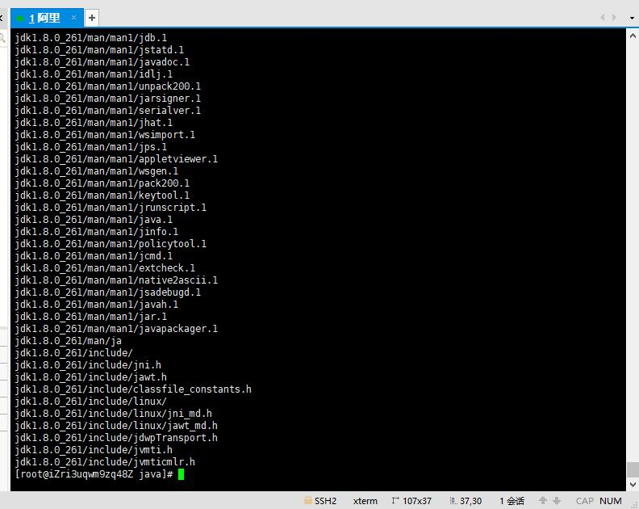</center></td>
        <td ><center>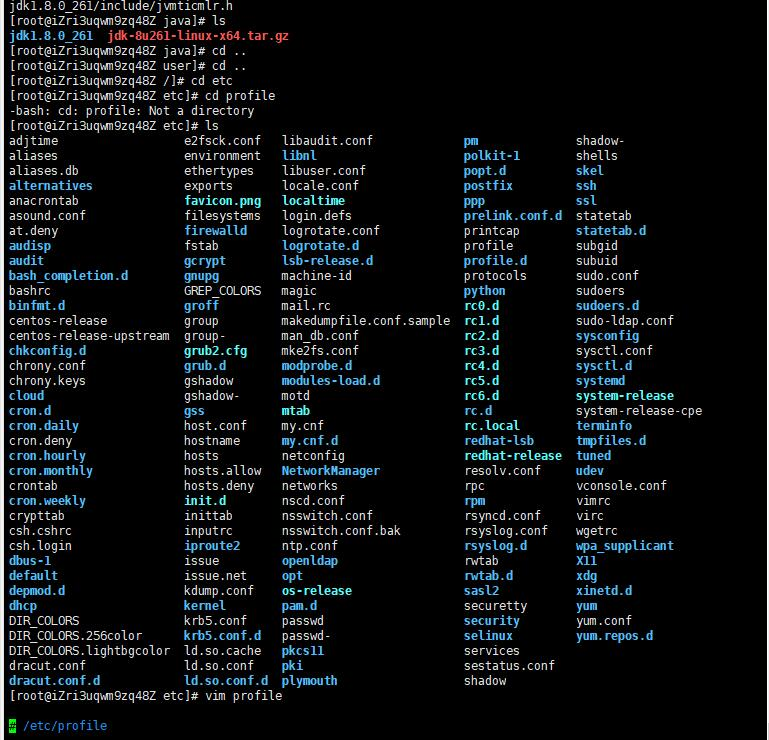</center></td>
        <td ><center>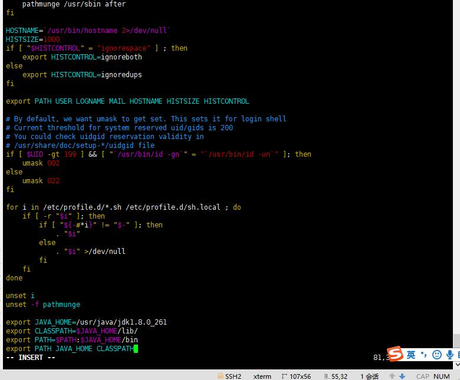</center></td>
    </tr>
</table>

#### 4.验证JDK安装是否成功：

```
java -version
```
<table>
    <tr>
        <td ><center>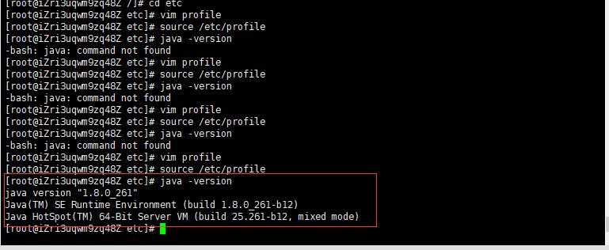</center></td>
    </tr>
</table>


## 五、配置Centos，安装MySQL数据库：

<table>
    <tr>
        <td ><center></center></td>
        <td ><center></center></td>
        <td ><center></center></td>
    </tr>
</table>

#### 1.安装MySQL：</br>
JDK配置完毕后，开始安装MySQL，使用以下指令依次安装MySQL环境：

```
yum install mysql
yum install mysql-server
yum install mysql-devel
```

安装mysql和mysql-devel都成功，安装mysql-server失败，报错信息如下：

```
[root@yl-web yl]# yum install mysql-server
Loaded plugins: fastestmirror
Loading mirror speeds from cached hostfile
 * base: mirrors.sina.cn
 * extras: mirrors.sina.cn
 * updates: mirrors.sina.cn
No package mysql-server available.
Error: Nothing to do
```
